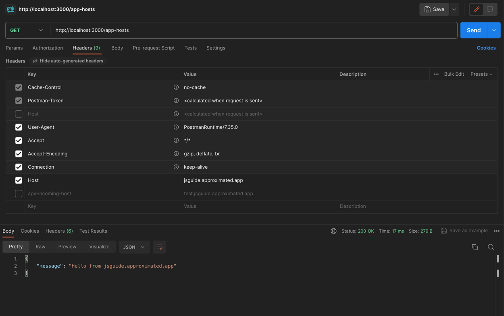
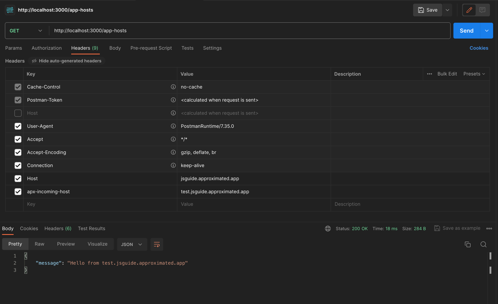

# Next.js Custom Domains Example

This is an example repo to help you understand how you could implement custom domains easily as a feature in your Next.js app.

There is also a companion guide to this repo that [you can find here](https://approximated.app/guides/nextjs-custom-domains-guide/).

> [!NOTE]
> This repo uses [Approximated](https://approximated.app) to automate the SSL certs and reverse proxying, but that is **not** a requirement.
>
> The approaches here are easily adaptable to other providers or implementations.

Vercel also has their [Platforms Starter Kit](https://github.com/vercel/platforms) that you can use as a guide. 

This repo was created as an alternative approach, and aims to provide a simpler introduction with implementations that will work regardless of where you host.

## How it works

The example app is just a basic fresh Next.js app, with examples for both the pages router and app router.

This is a toy app who's purpose is to conditionally display content depending on if the request occurs on a custom domain.

There is also an example of how to create and manage virtual hosts using the Approximated API, should you want to use it.

## Trying it out

#### Setup the `ENV`

```sh
cp .env.example .env
```

Inside the `.env` you can control the details about your setup:

```env
# the domain that your app runs on
NEXT_PUBLIC_APP_PRIMARY_DOMAIN=yourprimarydomain.com
# your Approximated API key, if you want to use it
APPROXIMATED_API_KEY=your_approximated_api_key
```

This assumes that you have NPM installed:

```sh
npm install
npm run dev
```

You should now have a server running on localhost. Usually `http://localhost:3000`.

## Mocking a custom domain locally

**Option 1:**

You can use tools like Postman to mock requests from a custom domain by setting the `host` header to the custom domain.

In our server side examples here, we have logic that checks the `host` header and displays content conditionally based on that.

We also have it first check for the `apx-incoming-host` header in our examples because we're using Approximated for SSL/reverse proxy, and it always injects the custom domain into that header.

The downside to this method is that it doesn't enable you to test in the browser easily.





You can see in this request, we have set the `apx-incoming-host` header so that we can test the code in [app/app-hosts/route.ts](app/app-hosts/route.ts).

> [!TIP]
> Why would we want to use a different header like `apx-incoming-host` instead of just `host` or `x-forwarded-host`?
>
> Because many existing apps may have a fair bit of logic (or other pieces in the stack) that expect/allow only one host, and may require quite a bit of modification to allow custom domains otherwise.
> 
> We can often completely avoid this issue by having a reverse proxy (like Approximated) set the host header to the primary (expected) domain for custom domain requests, and instead put the custom domain in a separate header for the pieces that need to know about it.


**Option 2:**

You may also use other methods to mock a custom domain, like editing your hosts file or using tools that manage local domains or DNS masking. 

These are typically a bit more work and may require some knowledge of how your local system handles domains/DNS, but they will allow you to test in the browser.


## Assets and CORS

If your app is linking to assets with absolute paths/URLs, changing it to a relative path should fix any CORS issues from a custom domain *if* you're using a reverse proxy in front and always setting the host to the primary domain (as mentioned in the tip above).

For example, change `https://yourapp.com/assets/something.js` to `/assets/something.js`. That way, they'll be loaded over whatever the domain is in the address bar, avoiding CORS issues if you're using the reverse proxy approach.

Otherwise, you may need to [implement CORS in your routes](https://github.com/vercel/next.js/tree/canary/examples/api-routes-cors) in a way that will support dynamic domains or allows any domain (less secure).

## Digging Deeper

### Routing options

#### Using the pages router

If you are using the pages router, it is likely [that using the `getServerSideProps` approach](pages/index.tsx) would be the best for you.

The reason for this is that you usually want to run the domain checking code on the server, before you render your pages. This is especially true when you want to use that custom domain to further authenticate the request.

Using `getServerSideProps` allows you to create logic that you can then pass down as props to your page components. Keep in mind that `getServerSideProps` can only be used on top level pages and not inside components. If you want to localize the logic to a component, and keep that logic on the server, consider using the app router and "React Server Components".

You can check the sudomain on the client side using `window.location.hostname` or `window.location.host`. This means you need to wait for the client to render, as well as using effects, in order to check that value.

#### Using the app router (React Server Components)

When using the app router, you can run server side code in your components. This allows you to check the details of the request at the component level. 

This can be handy when coupled with authentication to conditional render parts of your component based on the details extrapolated from the request custom domain.

### Implications of pre-rendering

It is possible to pre-render pages that conditionally use a custom domain or would otherwise render unique content given that a custom domain is used.

There are a few ways to go about this, depending on the pre-rendering approach and other tools in your stack:

#### Static Generation (SSG) - with the custom domain as the host header

Since static generation happens at build time, your app will need to know about any custom domains at that time as well if you're not using a reverse proxy in front to modify the host header to the primary domain.

For example, if your app is a blog hosting platform, you could pre-render content with the links, assets, etc. set to the correct custom domain.

If custom domains can be added after the fact, you'd need to re-render the content at that time as well.

Now, you can use Incremental Static Regeneration for this, but due to the complexity of that (and lack of support amongst many non-Vercel providers) we're going to skip it here. Perhaps in the future a section on that can be expanded.

Here's how you could do it with plain SSG:

1. Set the `.env` to a specific client custom domain
  - You would need to treat your app as a multi-tenant app where the `.env` sets the tenant.
  - You can then run `npm run build` whilst that "tenant" is set in the env, and render the specific content for them.
2. Use the "base url" for that tenant
  - When you are making requests, linking pages, or linking to assets, you need to be sure to use that clients custom domain.
3. Loop through all your "clients" and render their sites
  - You would need to change your build step to loop through each client/custom domain in order to render their version of the site. 

Consider these steps:
  1. Fetch the list of all the custom domains
  2. For each custom domain, create an `.env` specifically for them
  3. Run `npm run build`
  4. Deploy that static output
  5. Repeat for each client

There are a lot of variables to consider with this setup. So it is difficult to create a demo that could handle all the variants that your app may have.

Another challenge with this approach is that it is not aware of the new custom domains being added to your account. So you would need to make sure that this entire build loop is run when new custom domains are added - making this approach even more complicated.

---

#### Static Generation (SSG) - with the *primary domain* as the host header (requires reverse proxy in front)

This method doesn't require your app to know about custom domains at build time for pre-rendering.

Instead, a reverse proxy overwrites the host header in-flight before it reaches your app, setting it to the primary domain instead of the custom domain.

Depending on your routing logic, you may also want to have it inject the custom domain in a separate header so that it can use that to route to the correct SSG content.

If your app already routes to SSG content based on path, you'll need to have the reverse proxy rewrite requests to include that path as well. There are some pitfalls here to look out for here, [see here for more details](https://approximated.app/docs/#statically-generated-content).

Approximated can do this for you out of the box, and handle the pitfalls, but you can also use any reverse proxy you'd like.

---

#### Server Side Rendering (SSR)

Ideally, you can use server-side rendering to conditionally handle the requests to your app. This means using middleware, `getServerSideProps`, or the app router with React Server Components.

In this context, SSR is not 'pre-rendering' in the same way that SSG is because it's happening at request time. This lets us dynamically handle custom domains, and avoids most or all of the tricky parts involved with SSG.

Whether you're using the custom domain in the host header, or overriding it with the primary domain, typically matters a lot less with SSR as well.

---

### Pages Router

#### Using middleware to handle requests

You can use middleware to capture the request before it hits your page for rendering. You can use this to prepare a request before it hits your page, block or stop requests, preform redirects, or use the domain to preform authentication.

See [middleware.ts](middleware.ts).

#### Using API routes to handle requests

If you have API endpoints in your app that need to use the domain the process is similar to middleware. You can grab the domain off the header and use that in the rest of your code.

See [pages/api/host.ts](pages/api/host.ts).

#### Using `getServerSideProps` in pages

Like the API route, you can grab the domain off the headers in the request. You can the use that as `props` in your page when it is rendering.

See [pages/index.tsx](pages/index.tsx).

#### Using client side pages

If you are in a client context and want to get the domain, you can use `window.location.hostname` or `window.location.host` as long as you wrap the logic in a state callback.

See [pages/page-csr.tsx](pages/page-csr.tsx).

> [!WARNING]
> There are some situations where relying on client-side determination of custom domains may be less secure or more brittle. Ideally we want to handle this server-side where possible.

### App Router

#### Using route handlers

If you are using the new `app` directory, you have access to route handlers. Like the other methods, you can pull the domain that is in the request headers.

See [app/app-hosts/route.ts](app/app-hosts/route.ts).

#### Using app pages

If you are using the new `app` directory, you can use server side functions in your pages through server components.

See [app/ssr-page/page.tsx](app/ssr-page/page.tsx).

#### Using app client side pages

If you are using the new `app` directory and want to get the domain, you can use `window.location.hostname` or `window.location.host` as long as the page uses `"use client"`.

See [app/csr-page/page.tsx](app/csr-page/page.tsx).

> [!WARNING]
> There are some situations where relying on client-side determination of custom domains may be less secure or more brittle. Ideally we want to handle this server-side where possible.
